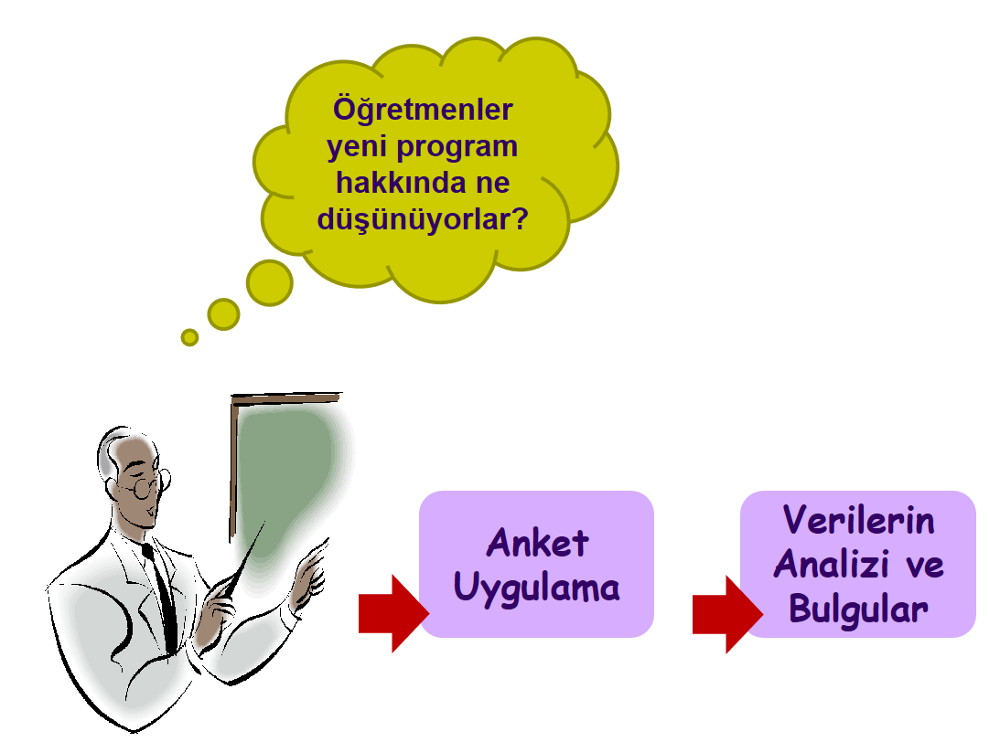
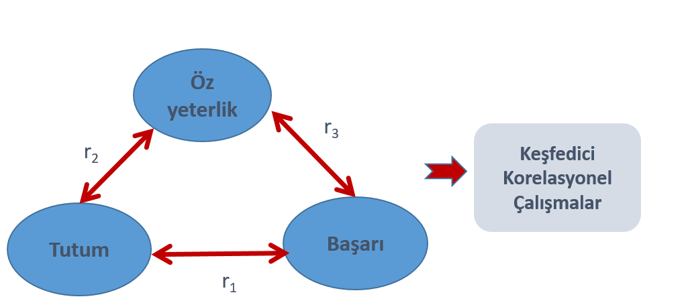
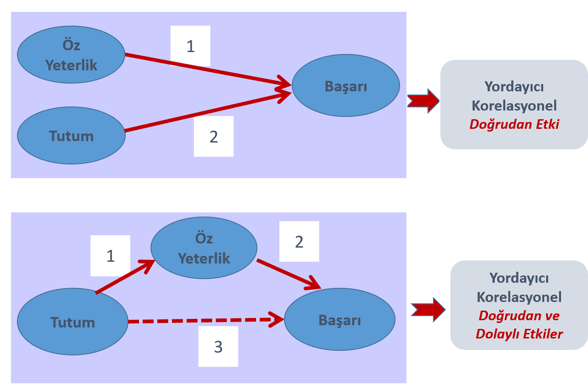
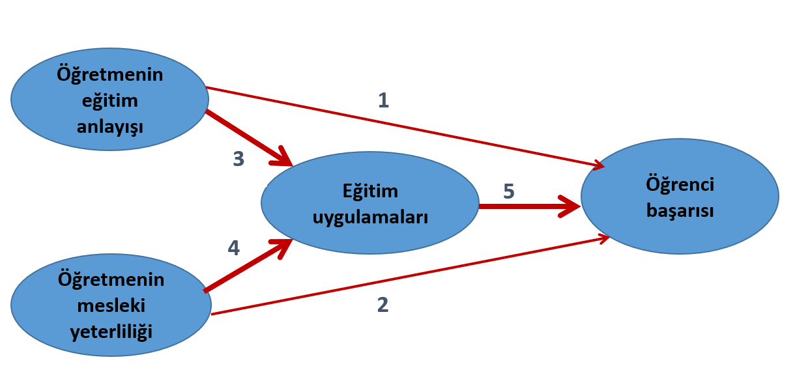

```{r child = "../setup.Rmd"}
```

```{r set-theme, include=FALSE}
library(emoji)
library(xaringanthemer)
library(dplyr)

style_duo_accent(
  primary_color      = "#0F4C81", # pantone classic blue
  secondary_color    = "#B6CADA", # pantone baby blue
  header_font_google = google_font("Raleway"),
  text_font_google   = google_font("Raleway", "300", "300i"),
  code_font_google   = google_font("Source Code Pro"),
  text_font_size     = "30px"
)
```

---
## Araştırmaların Sınıflandırılması .huge[`r emo::ji("stats")`]


## Araştırma deseni

- **Araştırmanın sorularını cevaplamak ya da hipotezlerini test etmek amacıyla araştırmacı tarafından geliştirilen bir plandır. **

- **Ölçme koşullarını** (müdahale, doğal akış, araştırmanın odağını…) tanımlar.

- **Olaylara nasıl bakıldığını** (pozitivist, constructivist, pragmatist) ortaya koyar.

<!-- --- -->
<!-- ## Araştırmalarda iç ve dış geçerlik -->

<!-- - Araştırmanın sonuçlarının deneklerin seçildiği büyük gruplara, **evrene genellenebilirlik derecesi dış geçerliktir.** -->

<!-- - **İç geçerlik**, yordayıcı ilişkilerin analizinde ve özellikle deneysel çalışmalarda esastır. -->

<!-- - İç geçerlik, **bağımlı değişkende gözlenen değişmelerin, bağımsız değişkenle açıklanabilirlik derecesidir.** -->

---
## Araştırmaların Sınıflandırılması .huge[`r emo::ji("stats")`]

-   Temel ve Uygulamalı Araştırmaları

-   Laboratuar ve Saha Araştırmaları

-   Anlık ve Boylamsal Araştırmaları

-   Kavramsal ve Ampirik Araştırmalar

-   Deneysel ve Deneysel Olmayan Araştırmalar


---
##   Temel ve Uygulamalı Araştırmaları


- temel araştırmalar yeni teorilerin geliştirilmesi amaçlar.

- temel araştırmaların doğrudan gerçek yaşam problemlerini çözüm üretme 
gibi bir hedefleri yoktur 
    - Genetik bozukluklar ve kalıtsal hastalıkları daha iyi anlayabilmek için 
    fareler üzerinde yapılan çalışmalar 
    - kısa süreli bellek ile uzun süreli belleğin kapasitlerinin karşılaştırılması 
    - stresin hafızı üzerindeki etkisinin test edilmesi 
    
- uygulamalı araştırmalar çoğunlukla temel araştırmalarda ulaşılan bilgiler 
üzerine inşa edilir kimi zaman da bunun tam tersi yaşanabilir.

- Bu bakımdan uygulamalı araştırmalar bazen yeni teorilerin geliştirilmesine
öncülük edebilir.


---
##   Laboratuar ve Saha Araştırmaları

- laboratuvar çalışmaları araştırma için özel olarak tasarlanmış ortamlarda yapılır

- araştırmacıya yüksek bir kontrol imkanı verir sonuçları hata karışmasına yol açabilecek faktörler minimum düzeyde tutulabilir 

- saha araştırmaları ise sıkı kontrollerin yer aldığı ortamlarda yapılmaz 

- olaylar, olgular, Kişiler kendi doğal ortamında incelenir. Örneğin okul sınıf spor salonu

---
## Anlık ve Boylamsal Araştırmaları

- anlık araştırmalarda katılımcılardan tek bir anda veri toplanır 

- boylamsal araştırmalarda ise aynı kişiler uzun bir süre takip edilir ve bu süre zarfında bireylerden belli aralıklarda birkaç kez veri toplanır 

- hem boylamsal hem de anlık araştırmaların kendilerine göre birtakım güçlü ve zayıf yönleri vardır.

- boylamsal araştırmaların en güçlü yanı incelenen olayın olgunun zaman içerisindeki değişimine dahi geçerliliği ve güvenilirliği yüksek sonuçlar üretebilmesidir.  fakat boylamsal çalışmalarda veri toplama işi zordur, fazla emek ve maliyet gerektirir 

- anlık çalışmaları ise değişkenlerin sadece anlık görüntüsünü sunması ve zaman içerisinde bilgi vermemesi gibi dezavantajlarına karşı düşük maliyet ve az emek gerektirir.


---
## Kavramsal ve Ampirik


- kavramsal araştırmacılar çoğunlukla felsefeciler ve düşünürler tarafından kullanılır bu araştırmalarda amaç alanyazındaki çalışmalara ait bulguları ve mevcut teorileri kullanarak yeni bir bakış açısı ortaya koymak ve fikirler üretmektir 

- ampirik çalışmaları ise veriye dayanır.


---
## Deneysel ve Deneysel Olmayan Araştırmalar

-  **Deney birtakım şartların değiştirilerek onların bir şeye etkisini gözlemleyerek** öğrenme yoludur. Deneyler **sebep-sonuç** ilişkisini yorumlayabilmek için
yapılır.

-   Neden-sonuç ilişkilerini belirlemeye çalışmak amacıyla doğrudan araştırmacının kontrolü altında, gözlenmek istenen verilerin üretildiği araştırma modelleridir.
  
-  Deneysel modelleri diğer tüm araştırma modellerinden ayıran özelliği, **araştırmacının bağımsız değişkeni manipüle edebilmesidir. **


---
## Araştırmaların Sınıflandırılması .huge[`r emo::ji("stats")`]
-   Nicel ve Nitel Araştırmalar

  -   Nicel Araştırmalar
      -   Tarama Araştırması
          - Nedensel Karşılşatırma
          - Korelasyonel Araştırma
      -   Deneysel Araştırma
      -   Meta Analiz 
      
  -   Nitel Araşatırma Desenleri
      -   İçerik Analizi
      -   Eylem Araştırması
      -   Durum Araştırması
      
-   Karma Yöntem Araştırmaları

---
## Bilimsel Araştırmaların Sınıflanması

- Yapıldıkları çevreye göre, **labrotuvar ve saha (alan)** araştırmaları;

- Düzeylerine göre **kuramsal ve uygulamalı** araştırmalar; 

- Yönteme göre tarihi, **betimsel ve deneysel** araştırmalar; 

- Kontrol özelliğine göre **survey ve deneysel** araştırmalar

- Varsayımları doğrulama ya da mevcut durumu belirleme yaklaşımlarına göre **nicel-nitel** araştırmalar olarak gruplandırılabilir

---
## Bilimsel Araştırmaların Sınıflanması

- Farklı sınıflamalar bulunmaktadır (Büyüköztürk, Çakmak, Akgün, Karadeniz, & Demirel, 2008; Karasar, 2003; Şekercioğlu, 2011/2015)

- Uygulama/Düzey açısından
  - Temel
  - Uygulamalı
- Amaç açısından 
    - Betimsel, 
    - İlişkisel
    - Açımlayıcı/Keşfedici
- Kullanılan inceleme yöntemine/ verinin türüne göre 
     - Nitel
     - Nicel


---
##  Nicel ve Nitel Araştırmalar

- **Nicel** araştırmalar değişkenler arasındaki **ilişkileri kanıtlamaya çalışır** ve bu tür ilişkilerin nedenlerini arar ve bazen açıklar.

- Nicel araştırmalar çoğunlukla ne kadar ne düzeyde gibi sorulara cevap arar.

- **Nitel araştırmalar,** durumları ve olayları katılımcıların bakış açılarından anlamaya çalışır. **Katılımcıların doğrudan araştırmanın içinde** yer alması söz konusudur.

- Nitel araştırmalarniçin nasıl ne şekilde sorularına cevap arar.

---
##  Nicel Araştırmalar

- Tarama Araştırması

- Korelasyonel Araştırma

- Nedensel Karşılaştırma Araştırması

---
.center[
## Tarama Araştırması
]
.pull-left[
- **Belirli özelliklerin** belirlenmesini amaçlar,
  - Anket
  - görüşme
  - Yüzde
  - frekans
]
.pull-right[
- Katılımcıların;
  - Demografik özeliklerinin,
  - Görüşlerinin, 
  - Yeterliklerinin,
  - Davranışlarının  belirlenmeye çalışıldığı araştırmalardır.

]
<br>
<br>
<br>


.center[
- **EGT204-05 şubesindeki öğrencilerin en çok sevdikleri kitap türü nedir?**
]

---
## Tarama Araştırması

```{r echo=FALSE, fig.align='center',out.width="50%"}

```

---
## Tarama araştırmalarının özellikleri

- Tarama deseni, araştırma sonuçlarının genelleneceği büyük grup olarak tanımlanan hedef kitle (evren) üzerinde veya evreni temsilen seçilen örneklem üzerinde çalışılır. 

- Verilerin toplanmasında temelde **anket kullanılmakla birlikte testler, ölçekler, yapılandırılmış gözlem formları ve kontrol listelerinden de yararlanılır.**


---
## Tarama araştırmalarının sınıflandırılması

- Anlık inceleme
    - Anlık
  
- Zamana bağlı değişimin incelenmesi
  - **Kesitsel:** Örneklemin gelişimsel olarak bir bütünü tamamlayacak şekilde birbirini tümleyen kesitlerden seçilmesi ve  verilerin tüm gruplardan aynı zamanda bir defa da toplanması ve analizi.
  - **Boylamsal:** Aynı örneklem üzerinde zamana bağlı ölçümlerin alınması ve gelişimin analizi.

- Geçmişe dönük inceleme
  - Katılımcıların geçmiş deneyimlerine dayalı olarak önceden yaşanmış olayların, geçmişin incelenmesi.

---
## Tarama araştırmalarında evrenin tanımlanması ve örneklemin seçimi

- Evren (hedef kitle) tanımlanır. 
- Evreni temsil edecek şekilde örneklem seçilir ve araştırma bu örneklem üzerinde yürütülür.

- Araştırma sonuçları evrene genellenir.

---
## Tarama araştırmalarında verilerin toplanması ve  analizi

- Odak nicel verilerin toplanmasıdır. Bununla birlikte ek olarak nitel veriler de toplanabilir. 

- Toplanan nicel veriler, uygun istatistik teknikler kullanılarak analiz edilir.

---
## Tarama araştırmalarında dış ve iç geçerliliği etkileyen durumlar

- **Denek kaybı (anketi cevaplamama, eksik cevap), **

- Verilerin toplandığı ortamın ve şartların katılımcıların **samimi görüşlerini belirtmelerine olanak tanımaması,** 

- Veri toplayan kişinin tutumu **(cevaplama davranışını etkileme)**

- Cevaplanacak soru sayısının **çok fazla olması, yönergenin anlaşılır olmaması gibi yapısal sorunlara bağlı cevaplama motivasyonunu düşmesi. **

---
## Korelasyonel Araştırması

- İki ya da daha fazla değişen arasındaki **ilişkinin** belirlenmesi amaçlar,

- Araştırmacı ölçme araçlarını uygulamak dışında herhangi bir **müdahale ya da yönlendirme yapmaz,**


- **EGT204-04 şubesindeki öğrencilerin en çok sevdikleri kitap türü ile başarı puanları arasıda nasıl bir ilişki vardır?**


---
## Örnek korelasyonel araştırmalar…

- Öğrencilerin **öğrenme stratejilerini kullanma sıklığı, sosyal etkinliklerine katılma sıklığı ve başarıları arasındaki ilişkinin incelenmesi.**

--

- Ailelerin **okulun eğitsel etkinliklerine ilgisi ve öğretmenle iletişim değişkenleri,  çocukların performansları üzerindeki etkisinin incelenmesi.**

--

- **Liselerin yaşı, yönetici tutumları, bir öğretmene düşen öğrenci sayısı ve geçmişteki başarı durumu değişkenlerinin, liselerdeki suç oranını açıklama gücünün incelenmesi.**

---
## Korelasyonel araştırmaların  odağı

- Karşılıklı **ilişkileri anlama,**

- Bir veya daha çok bağımsız değişkene dayalı olarak bir bağımlı değişkenin , **açıklanmaya (yordanmaya) çalışılması.** 

- Bu tür araştırmalarda, **sonuçlar nedensellik bağlamında yorumlanamaz.**

---
## Korelasyonel araştırmaların türleri
- **Keşfedici korelasyonel** araştırmalar
    - Değişkenler arasındaki karşılıklı ilişkiler belirlenmeye çalışılır.

- **Yordayıcı korelasyonel** araştırmalar
  - Değişkenler arası ilişkinin belirlenip bir veya daha fazla değişkenin bilinen değerinden diğer bir değişkenin bilinmeyen bir değeri belirlenmeye çalışılır.
  - Burada, gerçekte, oluşturulan matematiksel bir model (Y=bx+a) vardır ve o test edilir. 

  - Sadece **doğrudan etkilere** ve/veya **dolaylı etkilere** dayalı olmak üzere iki türü vardır.

---
## Korelasyonel Çalışmalar_1

```{r echo=FALSE, fig.align='center',out.width="70%"}

```


- Olası çıkarımlar:
- Başarıyı artırmak istiyorsan tutum ve özyeterliliği unutma, dikkate al. 
- Özyeterliliği artırarak başarıyı artırabilirsin
- Tutumla başarı arasındaki ilişki özyeterlilik aracılığıyla ortaya çıkmış olabilir.


---
## Korelasyonel Çalışmalar_2

```{r echo=FALSE, fig.align='center',out.width="70%"}

```

---
## Korelasyonel Çalışmalar_3

```{r echo=FALSE, fig.align='center',out.width="70%"}

```

---
## Korelasyonel araştırmalarda evren ve örneklem seçimi

- Örneklemde yer alacak bireylerin araştırmanın değişkenleriyle ilgili ölçülebilir özelliklere sahip olmaları ve seçkisiz seçilmeleri,

- Elde edilecek veri setleri için örneklem büyüklüğünün en az 30 olması hedeflenmelidir.

---
## Korelasyonel araştırmalarda verilerin toplanması ve analizi

- Nicel verilerin toplanmasını gerektirir. Bunun için anket, test, ölçek, kontrol listeleri kullanılabilir.

- Keşfedici korelasyonel desenlerde verilere uygun korelayon katsayıları (Pearson, Spearman, Phi, Bağımlılık vb.),

- Yordayıcı korelasyonel desenlerde regresyon analizleri, yol analizleri kullanılır.

---
## Korelasyonel desenlerde iç ve dış geçerlik

- Denek kaybı

- Verilerin toplandığı ortamların ve veri toplayan kişilerin (anketör vb.) farklılaşması. 

- Ölçme aracı yapısal sorunlar, cevaplama motivasyonun düşüklüğü
 
- Bu tür etkiyi kontrol etmenin yollarından biri yeterince büyük ve seçkisiz bir örneklemin belirlenmesidir.


---
## Yararlanılan Kaynak
Büyüköztürk, Ş., Çakmak E. K., Akgün, Ö. E., Karadeniz, Ş., Demirel, F. (2020). Eğitimde Bilimsel Araştırma Yöntemleri (28. Baskı), Ankara: Pegema Yayıncılık. 

